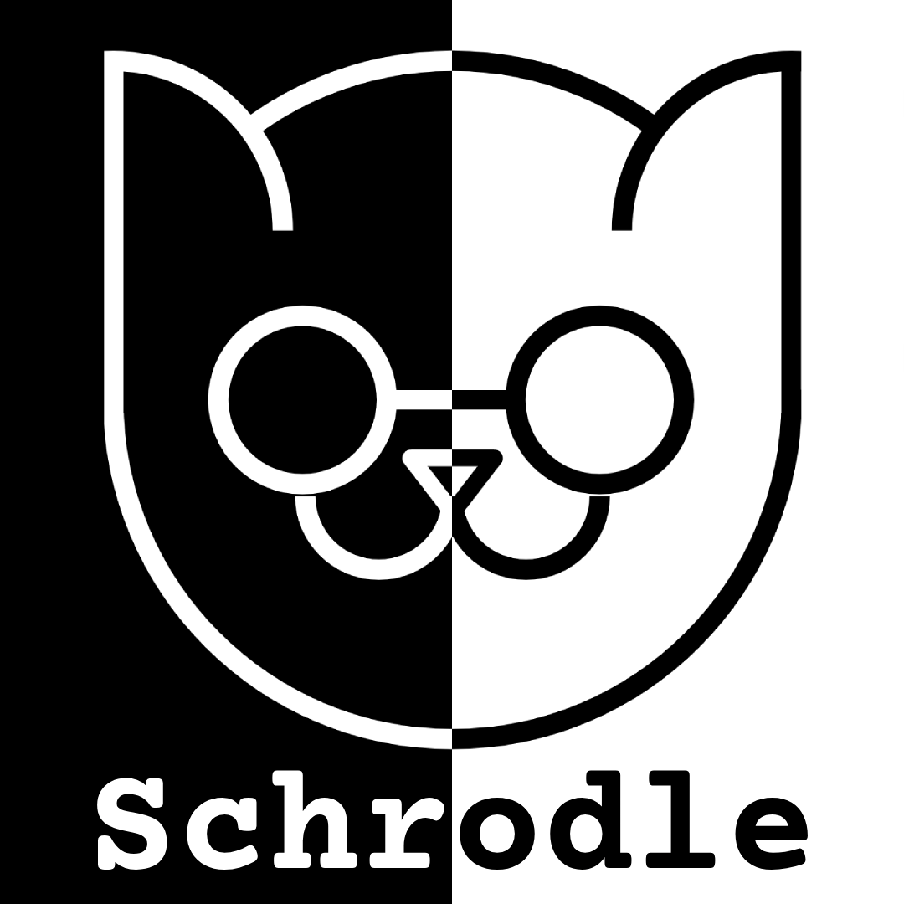
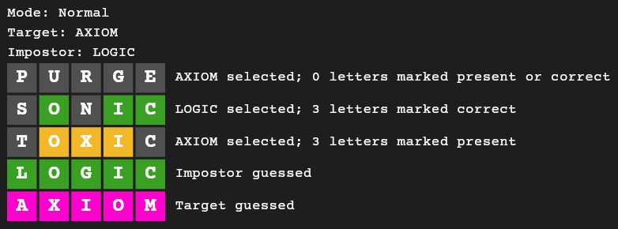

  

# [Schrodle](https://thoresonjd.github.io/schrodle/) 😸

## Premise

Schrodle is a game that is inspired by [Wordle](https://en.wikipedia.org/wiki/Wordle) and the [Schrödinger's Cat](https://en.wikipedia.org/wiki/Schr%C3%B6dinger's_cat) thought experiment. The game works exactly like Wordle, but with a twist. Like Wordle, the player is tasked with guessing the daily word, which we call the "target." However, in addition to the target, there is a secondary word, called the "impostor."

## Normal mode

Whenever a guess is made, there is a 50/50 chance that the guess will be validated against either the target or the impostor. Therefore, if the impostor is selected to validate the guess, letters can be marked as present in the target word when, in fact, they are absent (or in the incorrect position). It follows that letters may be simultaneously market correctly and incorrectly with respect to the target. Thus, the Schrödinger's Cat thought experiment is in essence, upheld.

## Probabilistic mode

When the target is selected, the probability to select it in a subsequent guess decreases. Conversely, the probability to select the target word will increase if it is not selected. The impostor has an inverse probability as the target, where the total selection probability for both equates to 100%. 

## Hard mode

The guess is validated against a constructed word where each individual letter has a 50/50 chance of being derived from the corresponding index in either the target or the impostor. To compensate, the player is allotted additional guesses.

## Example Scenario

## Setup

To set up this project locally:
- Install the [Flutter SDK](https://docs.flutter.dev/get-started/install)
- Clone this repository
- Run `flutter pub get` in the root directory of this repository

## Credit

Created by Justin Thoreson and Ana Mendes.\
Inspired by [Wordle](https://en.wikipedia.org/wiki/Wordle), developed by Josh Wardle.\
Inspired by the [Schrödinger's Cat](https://en.wikipedia.org/wiki/Schr%C3%B6dinger's_cat) thought experiment, devised by Erwin Schrödinger.